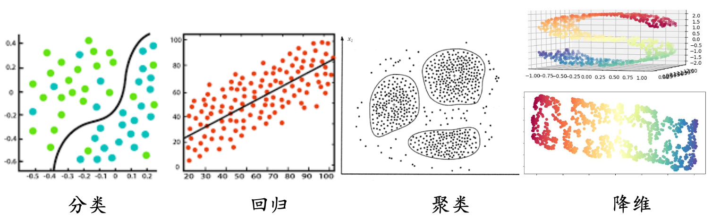
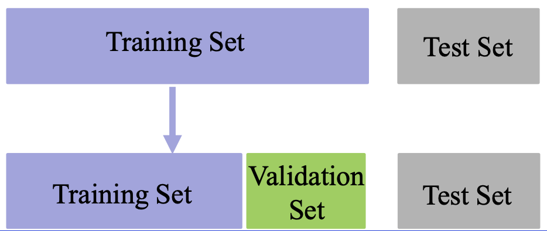
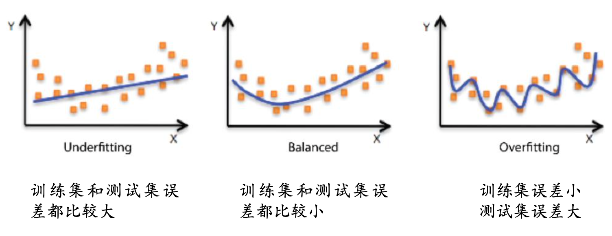
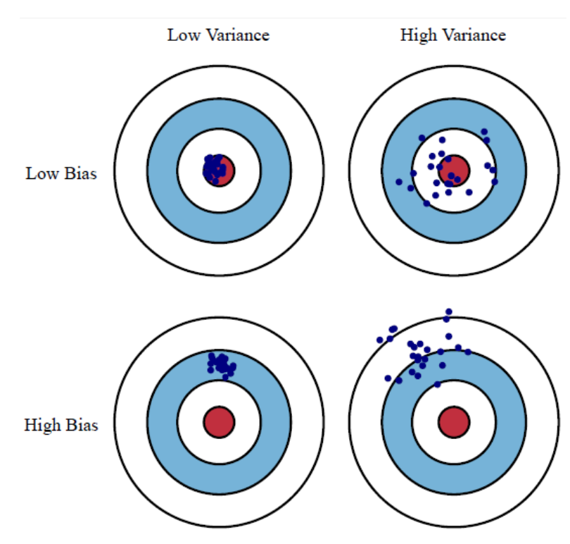
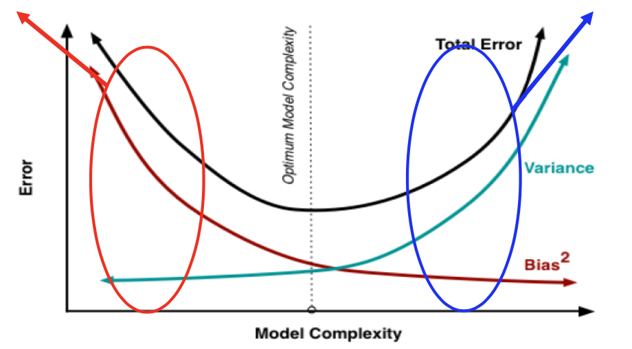
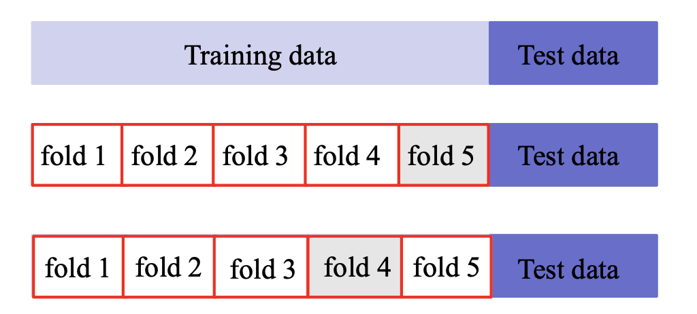

机器学习基础

1. 数据集
2. 误差分析
3. 代表的机器学习方法
   1. 有监督、线性回归、SVM、决策树、RF
   2. 无监督、聚类、降维（PCA）

# 机器学习

### 基本概念

机器学习是指让计算机具有像人一样的学习和思考能力的技术的总称。具体来说是从已知数据中获得规律，并利用规律对未知数据进行预测的技术。

机器学习分类：

- 有监督学习(SupervisedLearning)：有老师(环境)的情况下，学 生(计算机)从老师(环境)那里获得对错指示、最终答案的学习 方法。**跟学师评**
- 无监督学习(UnsupervisedLearning)：没有老师(环境)的情况 下，学生(计算机)自学的过程，一般使用一些既定标准进行评价。 **自学标评**
- 强化学习(Reinforcement Learning)：没有老师(环境)的情况下， 学生(计算机)对问题答案进行自我评价的方法。自学自评

机器学习可以做如下两种分类

- 有监督学习：代表任务“分类”和“回归”
- 无监督学习：代表任务“聚类”和“降维”

### 数据集

数据集：观测样本的集合。具体地，$𝐷={𝑥_1,𝑥_2,⋯,𝑥_𝑛}$ 表示一个包含*n*个样本的数据集，其中 $𝑥_𝑖$ 是一个向量，表示数据集的第𝑖个样本，其维度𝑑称为样本空间的维度。

向量 $𝑥_𝑖$ 的元素称为样本的特征，其取值可以是连续的，也可以是离散的。从数据集中学出模型的过程，便称为“学习”或“训练”。

**数据集分类**

- 训练集(Trainingset)：用于模型拟合的数据样本；
- 验证集(Validation set)：是模型训练过程中单独留出的样本集，它可以用于调整模型的超参数和用于对模型的能力进行初步评估；
  - 例如SVM中参数 $c$ (控制分类错误的惩罚程度)和核函数的选择， 或者选择网络结构

- 测试集(Testset):用来评估模最终模型的泛化能力。但不能作为调 参、选择特征等算法相关的选择的依据。

**常见数据集**

- 图像分类
  - MNIST(手写数字) http://yann.lecun.com/exdb/mnist/
  - CIFAR-10, CIFAR-100, ImageNet
    -  https://www.cs.toronto.edu/~kriz/cifar.html 
    - http://www.image-net.org/
- 电影评论情感分类
  - Large Movie Review Dataset v1.0
    - http://ai.stanford.edu/~amaas/data/sentiment/

- 图像生成诗歌
  - 数据集:https://github.com/researchmm/img2poem

# 误差分析

误差是指算法实际预测输出与样本真实输出之间的差异。

- 模型在训练集上的误差称为“训练误差”
- 模型在总体样本上的误差称为“泛化误差”
- 模型在测试集上的误差称为“测试误差”

由于我们无法知道总体样本会，所以我们只能尽量最小化训练误差， 导致训练误差和泛化误差有可能存在明显差异。

**过拟合**是指模型能很好地拟合训练样本，而无法很好地拟合测试样本的现象，从而导致泛化性能下降。为防止“过拟合”，可以选择减少参数、降低模型复杂度、正则化等

**欠拟合**是指模型还没有很好地训练出数据的一般规律，模型拟合程度不高的现象。为防止“欠拟合”，可以选择调整参数、增加迭代深度、换用更加复杂的模型等。

### 泛化误差分析

假设数据集上需要预测的样本为Y，特征为X，潜在模型为 $Y=f(X)+ε$，其中$ε \sim N(0,σ_ε)$是噪声, 估计的模型为$\hat{f}(X)$.
$$
\begin{array}{l}\operatorname{Err}(\hat{f})=\mathrm{E}\left[(Y-\hat{f}(\mathrm{X}))^{2}\right] \\ \operatorname{Err}(\hat{f})=\mathrm{E}\left[(f(X)+\varepsilon-\hat{f}(\mathrm{X}))^{2}\right] \\ \operatorname{Err}(\hat{f})=\mathrm{E}\left[(f(X)-\hat{f}(\mathrm{X}))^{2}+2 \varepsilon(f(X)-\hat{f}(\mathrm{X}))+\varepsilon^{2}\right] \\ \operatorname{Err}(\hat{f})=\mathrm{E}\left[(E(\hat{f}(\mathrm{X}))-f(X)+\hat{f}(\mathrm{X})-E(\hat{f}(\mathrm{X})))^{2}\right]+\sigma_{\varepsilon}^{2} \\ \operatorname{Err}(\hat{f})=\mathrm{E}[(E(\hat{f}(\mathrm{X}))-f(X))]^{2}+\mathrm{E}\left[(\hat{f}(\mathrm{X})-E(\hat{f}(\mathrm{X})))^{2}\right]+\sigma_{\varepsilon}^{2} \\ \operatorname{Err}(\hat{f})=\operatorname{Bias}^{2}(\hat{f})+\operatorname{Var}(\hat{f})+\sigma_{\varepsilon}^{2}\end{array}
$$
**偏差**(bias)反映了模型在 样本上的期望输出与真实 标记之间的差距，即模型本身的精准度，反映的是模型本身的拟合能力。

**方差**(variance)反映了模 型在不同训练数据集下学 得的函数的输出与期望输出之间的误差，即模型的稳定性，反应的是模型的波动情况。

欠拟合：高偏差低方差

- 寻找更好的特征，提升对数据的刻画能力
- 增加特征数量
- 重新选择更加复杂的模型

过拟合：低偏差高方差

- 增加训练样本数量
- 减少特征维数，高维空间密度小
- 加入正则化项，使得模型更加平滑

### 交叉验证

基本思路：将训练集划分为K份，每次采用其中K-1份作为训练集， 另外一份作为验证集，在训练集上学得函数后，然后在验证集上计 算误差---K折交叉验证

- K折重复多次，每次重复中产生不同的分割
- 留一交叉验证(Leave-One-Out)

# 有监督学习

- 数据集有标记(答案)
- 数据集通常扩展为$(𝑥_𝑖,𝑦_𝑖)$，其中$𝑦_𝑖∈Y$是 $𝑥_𝑖$ 的标记，$Y$ 是所有标记的集合，称为“标记空间”或“输出空间”
- 监督学习的任务是训练出一个模型用于预测 $𝑦$ 的取值，根据 $𝐷=\{(𝑥_1,𝑦_1 ),(𝑥_2,𝑦_2),⋯, (𝑥_𝑛,𝑦_𝑛)\}$，训练出函数𝑓，使得$𝑓(𝑥)≅𝑦$
- 若预测的值是离散值，如年龄，此类学习任务称为“分类”
- 若预测的值是连续值，如房价，此类学习任务称为“回归”

### 线性回归

### 逻辑回归

### 支持向量机

### 决策树

### 随机森林

# 无监督学习

- 数据集没有标记信息(自学)
- 聚类：我们可以使用无监督学习来预测各样本之间的关联度，把关 联度大的样本划为同一类，关联度小的样本划为不同类，这便是 “聚类”
- 降维：我们也可以使用无监督学习处理数据，把维度较高、计算复 杂的数据，转化为维度低、易处理、且蕴含的信息不丢失或较少丢 失的数据，这便是“降维”

### 聚类

### 降维

